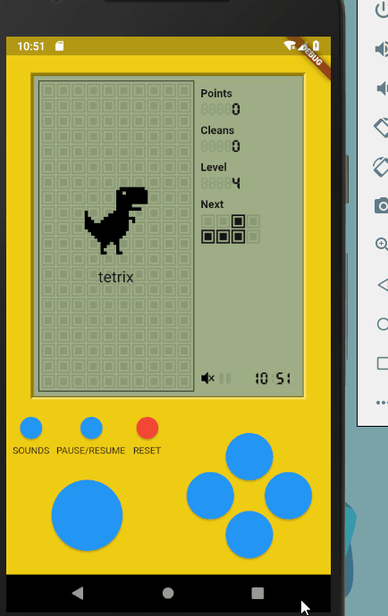
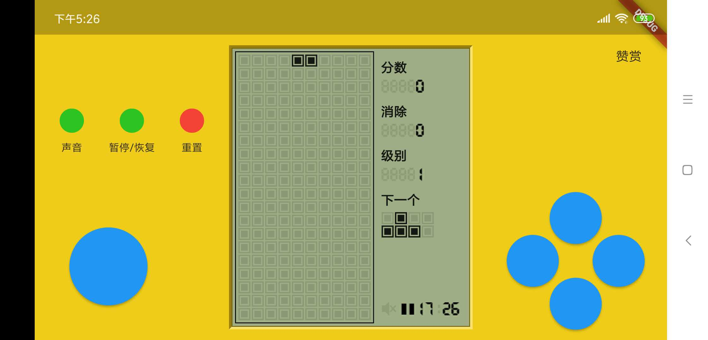

#### 中文介绍

请前往 [README](https://github.com/boyan01/flutter-tetris/blob/master/README.md)
# flutter-tetris
  [-blue.svg)](https://github.com/996icu/996.ICU/blob/master/LICENSE)

---

a tetris game powered by flutter.

Inspired by [vue-tetris](https://github.com/Binaryify/vue-tetris).

## Getting Started

* Compile by yourself

  install [Flutter](https://flutter.io/docs/get-started/install)

  run in Command Line：`flutter run --profile`

* download Apk file at page [releases](https://github.com/boyan01/flutter-tetris/releases)（for Android only)

## Preview

support landscape

## Other

MIT with 996 License
